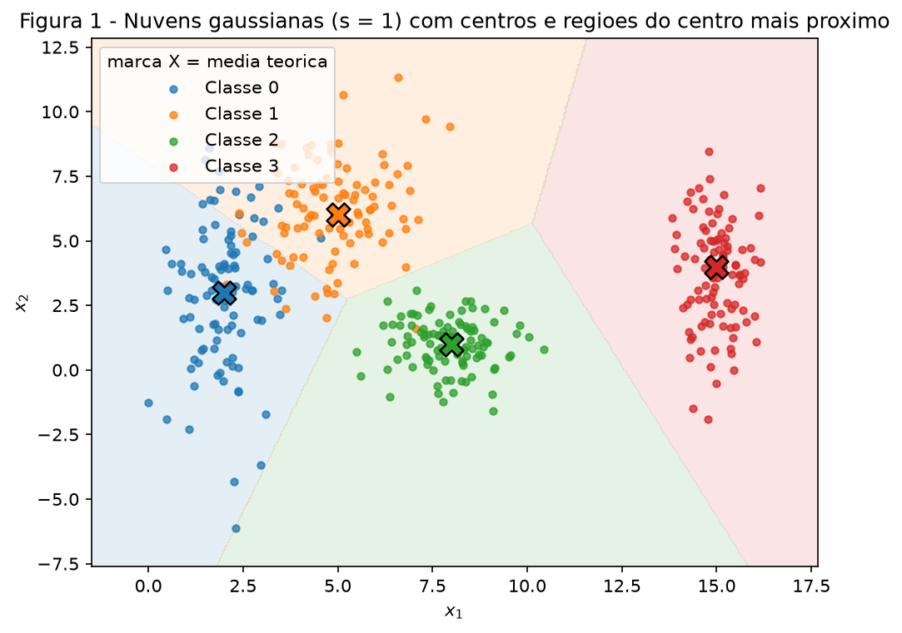
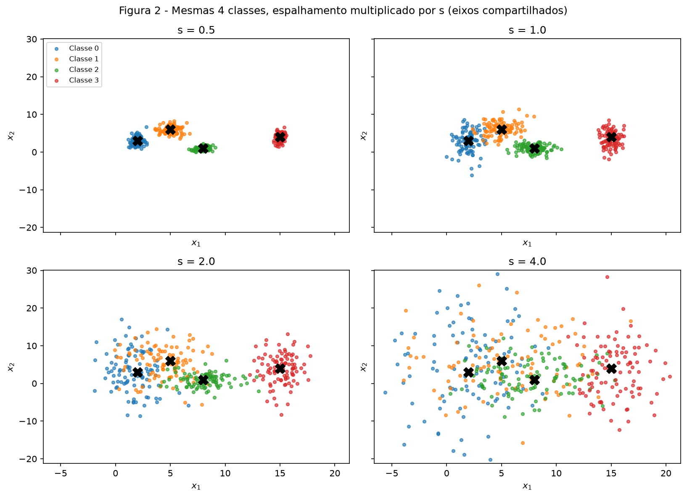
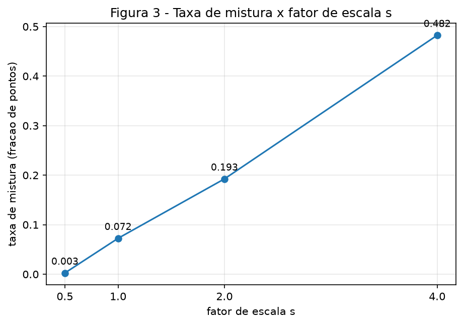
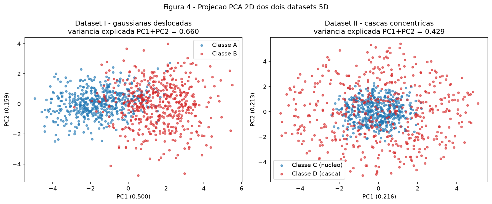
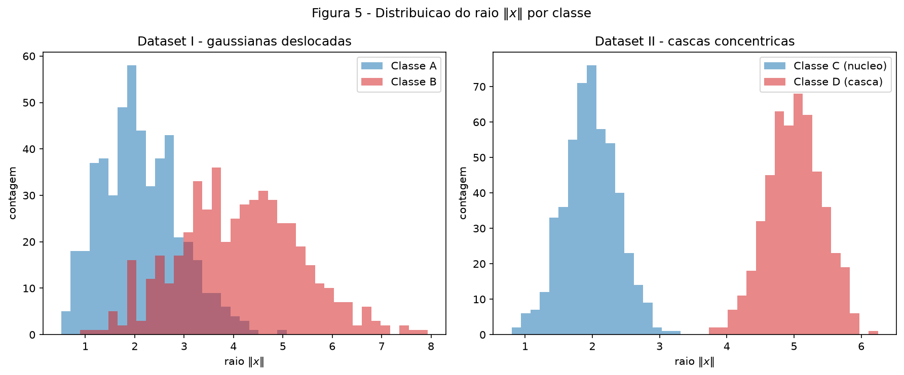
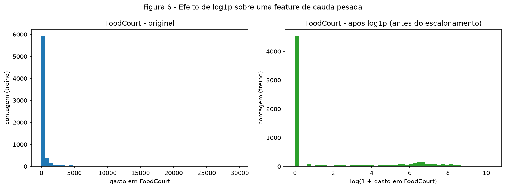

# 1. Data

!!! abstract "Enunciado"

    [Exercises → Data](https://insper.github.io/ann-dl/){:target='_blank'} — edição 2026.2.

Todo o código está em [`code/`](https://github.com/lucasnov/neural-networks-and-deep-learning/tree/main/docs/exercises/data/code)
e entra neste relatório direto dos arquivos reais, sem colar o texto do código aqui.
A semente é fixa em todos os scripts (`SEED = 42`, `rng = np.random.default_rng(SEED)`)
e cada script pode ser rodado sozinho ou pelo agregador:

``` shell
python docs/exercises/data/code/run_all.py
```

O `run_all.py` regenera as seis figuras e imprime o mesmo "Resumo dos resultados" que
está no fim desta página. Rodei duas vezes e os números não mudaram.

O caminho compartilhado (raiz do repositório, dataset, pasta de figuras) fica em `common.py`:

``` { .python .select linenums='1' title="docs/exercises/data/code/common.py" }
--8<-- "docs/exercises/data/code/common.py"
```

---

## Exercício 1 — Nuvens de Pontos: Geometria e Espalhamento em 2D

### A — Gere as nuvens

Gerei 400 pontos, 100 por classe, amostrando cada coordenada de uma normal independente
com a média e o desvio padrão do enunciado:

| Classe | Média | Desvio padrão | $\bar\sigma_k = (\sigma_x+\sigma_y)/2$ |
|--------|-------|---------------|---------------------------------------|
| 0 | $[2, 3]$ | $[0.8, 2.5]$ | 1.65 |
| 1 | $[5, 6]$ | $[1.2, 1.9]$ | 1.55 |
| 2 | $[8, 1]$ | $[0.9, 0.9]$ | 0.90 |
| 3 | $[15, 4]$ | $[0.5, 2.0]$ | 1.25 |

A **Figura 1** mostra as quatro nuvens com $s = 1$. As marcas `X` são as médias teóricas.
O fundo colorido é o esboço das fronteiras de decisão descrito no item C.


/// caption
**Figura 1** — Quatro classes gaussianas em $s = 1$. Marca `X` = média teórica; o
sombreamento é a região atribuída ao centro teórico mais próximo (construção geométrica,
sem modelo treinado).
///

### B — Mais ou menos espalhado

Gerei as mesmas quatro classes quatro vezes, multiplicando todos os desvios padrão
por $s \in \{0.5, 1.0, 2.0, 4.0\}$ e mantendo as médias fixas. São quatro datasets de
quatro classes. Gero os quatro de uma vez, em ordem crescente de $s$, reaproveitando o
mesmo `rng` (sem reiniciar a semente dentro do laço). A **Figura 2** usa os mesmos
limites de eixo nos quatro subplots.


/// caption
**Figura 2** — As mesmas quatro classes, com o espalhamento multiplicado por $s$. Eixos
compartilhados para a comparação ser honesta. Em $s = 0.5$ as nuvens são ilhas isoladas;
em $s = 4.0$ ocupam quase toda a área e se sobrepõem.
///

**Razão de separação ($s = 1$).** Para cada par $(i, j)$:

$$
r_{ij} = \frac{\lVert \mu_i - \mu_j \rVert}{\bar\sigma_i + \bar\sigma_j}
$$

Como isso só depende dos parâmetros (não dos pontos), calculei direto das médias e
desvios:

| Par | $\lVert \mu_i - \mu_j \rVert$ | $\bar\sigma_i + \bar\sigma_j$ | $r_{ij}$ |
|-----|------|------|------|
| (0, 1) | 4.243 | 3.20 | **1.326** |
| (0, 2) | 6.325 | 2.55 | 2.480 |
| (0, 3) | 13.038 | 2.90 | 4.496 |
| (1, 2) | 5.831 | 2.45 | 2.380 |
| (1, 3) | 10.198 | 2.80 | 3.642 |
| (2, 3) | 7.616 | 2.15 | 3.542 |

O menor é $r_{01} = 1.326$: as classes 0 e 1 são o par mais próximo em relação ao próprio
espalhamento. Como as médias não mudam e $\bar\sigma_k$ escala com $s$, $r_{ij}$ escala
com $1/s$. Então em $s = 2$: $r_{01} = 1.326 / 2 = 0.663$.

**Taxa de mistura.** Para cada $s$, comparei cada ponto às quatro médias teóricas e contei
a fração cujo centro mais próximo não é o da sua classe:

| $s$ | Taxa de mistura |
|-----|-----------------|
| 0.5 | 0.003 |
| 1.0 | 0.072 |
| 2.0 | 0.193 |
| 4.0 | 0.482 |


/// caption
**Figura 3** — Taxa de mistura × $s$. Quase zero em $s = 0.5$, sobe para 7% em $s = 1$,
19% em $s = 2$ e 48% em $s = 4$ (com quatro classes, 75% seria o acerto aleatório).
///

Na minha leitura, a separação por retas simples para de funcionar bem a partir de
$s \approx 2$. Nesse ponto $r_{01}$ cai para $0.663 < 1$, ou seja, os centros das classes
0 e 1 ficam mais perto um do outro do que a soma dos seus espalhamentos médios. A Figura 2
mostra as classes 0, 1 e 2 já se tocando, e a taxa de mistura salta de 7% para 19%. Em
$s = 1$ ainda dá para traçar retas razoáveis entre os pares; já em $s = 4$, com 48% de
mistura, nenhuma reta separa mais as classes centrais.

``` { .python .select linenums='1' title="docs/exercises/data/code/exercise1_point_clouds.py" }
--8<-- "docs/exercises/data/code/exercise1_point_clouds.py"
```

### C — Análise

Em $s = 1$ as classes 2 e 3 são compactas e ficam longe de tudo. Já a classe 0 é alongada
na vertical (desvio 2.5 em $y$) e a classe 1 fica logo acima dela; é na borda entre essas
duas que aparece a única sobreposição relevante, o que bate com $r_{01}$ ser o menor valor
da tabela.

Uma única reta não dá conta de separar as quatro classes, porque ela divide o plano em
apenas dois lados e aqui há quatro classes em quatro regiões diferentes. Uma reta resolve
um problema binário de cada vez, não mais que isso.

Um conjunto de retas já resolve, ao menos de forma aproximada: com três ou quatro dá para
recortar o plano nas quatro regiões que aparecem na Figura 1. É basicamente o que os
neurônios de uma camada escondida fazem, cada um traçando um hiperplano, e as camadas
seguintes combinam esses meios-planos em regiões maiores. O sombreamento que coloquei na
Figura 1 (a região do centro mais próximo) é o meu esboço dessas fronteiras: são retas por
partes, e acho que uma rede treinada com poucos neurônios chegaria perto disso.

Isso conecta direto com o item B. Onde duas nuvens se sobrepõem existe uma faixa em que os
pontos das duas classes se misturam e nenhuma fronteira acerta todos; essa é a região de
erro inevitável. Quando aumento $s$, cada nuvem cresce, essas faixas de sobreposição
alargam e a taxa de mistura sobe (Figura 3). A rede continua conseguindo traçar a fronteira
"certa" (o lugar geométrico onde as duas classes são igualmente prováveis), só que a fração
de pontos do lado errado dessa fronteira cresce junto com o espalhamento.

---

## Exercício 2 — Não-Linearidade em Dimensões Maiores

### A — Dataset I: gaussianas deslocadas

500 amostras por classe, com `rng.multivariate_normal` e os parâmetros do enunciado:
$\mu_A = [0,0,0,0,0]$, $\mu_B = [1.5,1.5,1.5,1.5,1.5]$, e as duas matrizes de covariância
$5\times5$ (copiadas na íntegra no código, incluindo a correlação positiva em $\Sigma_A$ e
a negativa entre as duas primeiras features em $\Sigma_B$). O código confere que as
matrizes têm formato $5\times5$.

### B — Dataset II: cascas concêntricas

500 amostras por classe, também em 5D. Para cada ponto: sorteio $v \sim \mathcal{N}(0, I_5)$,
normalizo para uma direção unitária $u = v / \lVert v \rVert$ (com uma proteção
`max(norma, 1e-12)` contra divisão por zero), sorteio o raio $\rho$ e faço $x = \rho\, u$.
A classe C (núcleo) tem $\rho \sim \mathcal{N}(2.0, 0.4)$ e a classe D (casca)
$\rho \sim \mathcal{N}(5.0, 0.4)$.

### C — Visualize e compare

Apliquei PCA separadamente em cada dataset, com 2 componentes, sem padronizar antes: os
dados já estão numa escala comparável e a pergunta aqui é sobre a geometria bruta dos
pontos.


/// caption
**Figura 4** — PCA 2D. No Dataset I as classes se separam ao longo de PC1; no Dataset II
os dois PCs capturam pouca variância e as classes ficam uma sobre a outra.
///

Variância explicada pelos dois primeiros componentes:

| Dataset | PC1 | PC2 | PC1 + PC2 |
|---------|-----|-----|-----------|
| I — gaussianas deslocadas | 0.500 | 0.159 | **0.660** |
| II — cascas concêntricas | 0.216 | 0.213 | **0.429** |

A projeção 2D preserva melhor a informação de classe no Dataset I. Ali, a direção que
separa as classes é o deslocamento $\mu_B - \mu_A$, que também é uma direção de bastante
variância, então a PCA a mantém e PC1 sozinho já quase separa as classes. No Dataset II a
informação que separa é o raio, e todas as direções têm variância parecida porque as
cascas são isotrópicas: os cinco autovalores ficam quase iguais ($\approx 0.2$ cada).
Qualquer projeção 2D perde mais da metade da variância nesse caso, e nenhuma projeção
linear enxerga o raio.

**Distância entre os centros das classes (em 5D, médias empíricas):**

| Dataset | $\lVert \mu_1 - \mu_2 \rVert$ |
|---------|------------------------------|
| I | 3.228 |
| II | 0.266 |

No Dataset I os centros estão a 3.2 de distância. No Dataset II os dois centros são quase
o mesmo ponto (a média de uma casca esférica é a origem), então a distância é ~0.


/// caption
**Figura 5** — Distribuição do raio $\lVert x \rVert$. No Dataset I os raios se
sobrepõem bastante; no Dataset II as duas classes ocupam faixas de raio quase disjuntas
(em torno de 2 e de 5).
///

``` { .python .select linenums='1' title="docs/exercises/data/code/exercise2_geometry_5d.py" }
--8<-- "docs/exercises/data/code/exercise2_geometry_5d.py"
```

### D — Análise

Um hiperplano é definido por $w^\top x + b = 0$ e sempre tem um lado positivo e um lado
negativo. No Dataset II a classe D (casca) envolve a classe C (núcleo) por todos os lados,
então qualquer hiperplano que eu tente traçar vai cortar a casca: parte dela cai do mesmo
lado do núcleo. Não tem como pôr uma bola inteira de um lado e a casca que a cerca do
outro lado. Os centros quase iguais confirmam essa leitura: um separador linear olha para
a posição média, e as duas classes têm praticamente a mesma média.

Nenhuma quantidade de dados resolve isso com uma fronteira linear, porque o problema não é
de estimativa: a classe verdadeira depende de $\lVert x \rVert$, e essa não é uma função
linear de $x$. Mais dados deixam as cascas mais densas, mas a forma continua a mesma, e uma
casca em volta de um núcleo nunca é linearmente separável, por definição.

Uma projeção 2D com classes misturadas não prova que elas sejam inseparáveis no espaço
original. A PCA é linear e escolhe as direções de maior variância, não as de maior
separação entre classes. No Dataset II a projeção (Figura 4, painel direito) mostra as
classes completamente embaralhadas, e mesmo assim elas são perfeitamente separáveis em 5D,
só que por uma fronteira não linear. A projeção ruim é uma limitação do método, não uma
propriedade dos dados.

**Função simples que separa o Dataset II:**

$$
g(x) = \sum_{i=1}^{5} x_i^2 = \lVert x \rVert^2, \qquad
\text{classe} = \begin{cases} \text{núcleo}, & g(x) \le 12.25 \\ \text{casca}, & g(x) > 12.25 \end{cases}
$$

O limiar é o quadrado do raio médio entre as duas cascas: $((2.0 + 5.0)/2)^2 = 12.25$. O
núcleo tem $g \approx 4$ e a casca tem $g \approx 25$, então essa regra classifica
corretamente os 1000 pontos do dataset. É uma regra geométrica escrita à mão, não uma rede
neural nem um modelo treinado, e funciona porque as classes diferem só no raio. Imagino que
uma rede com `tanh` aprenderia algo parecido, já que termos como $x_i^2$ surgem
naturalmente quando se combinam entradas de forma não linear.

---

## Exercício 3 — Preparando Dados do Mundo Real para uma Rede Neural

### A — Conheça os dados

O **Spaceship Titanic** (`train.csv`, 8693 linhas, 14 colunas) descreve passageiros de uma
nave que atravessou uma anomalia no espaço-tempo. O alvo **`Transported`** é booleano:
`True` se o passageiro foi transportado para outra dimensão. O problema é de classificação
binária.

O balanceamento é bom: 4378 `True` (50.4%) e 4315 `False` (49.6%), praticamente
equilibrado, então não precisa de reamostragem.

As features se dividem assim:

| Papel | Colunas |
|-------|---------|
| Numéricas | `Age`, `RoomService`, `FoodCourt`, `ShoppingMall`, `Spa`, `VRDeck` |
| Categóricas | `HomePlanet`, `CryoSleep`, `Destination`, `VIP` |
| Identificador / descartadas | `PassengerId`, `Cabin`, `Name` |
| Alvo | `Transported` |

Valores faltantes por coluna (omiti as que não têm nenhum):

| Coluna | Faltantes | % |
|--------|-----------|---|
| CryoSleep | 217 | 2.50 |
| ShoppingMall | 208 | 2.39 |
| VIP | 203 | 2.34 |
| HomePlanet | 201 | 2.31 |
| Name | 200 | 2.30 |
| Cabin | 199 | 2.29 |
| VRDeck | 188 | 2.16 |
| Spa | 183 | 2.11 |
| FoodCourt | 183 | 2.11 |
| Destination | 182 | 2.09 |
| RoomService | 181 | 2.08 |
| Age | 179 | 2.06 |

Nenhuma coluna passa de 2.5% de faltantes, então dá para imputar sem perder muita
informação.

Estatísticas das colunas de gasto, calculadas no dataset bruto completo:

| Coluna | Média | Mediana | Máximo |
|--------|-------|---------|--------|
| RoomService | 224.69 | 0.0 | 14327 |
| FoodCourt | 458.08 | 0.0 | 29813 |
| ShoppingMall | 173.73 | 0.0 | 23492 |
| Spa | 311.14 | 0.0 | 22408 |
| VRDeck | 304.85 | 0.0 | 24133 |

Em todas as cinco colunas a mediana é 0 e a média fica na casa das centenas. Isso quer
dizer que mais da metade dos passageiros não gastou nada em cada serviço e um grupo
pequeno gastou muito, com o máximo chegando perto de 30 mil. É uma distribuição bem
assimétrica à direita, de **cauda longa**: a média é puxada para cima pelos poucos
gastadores altos e acaba não representando o passageiro típico. Para uma rede, esses
valores gigantes viram entradas enormes que dominam os pesos, e é por isso que uso
`log(1+x)` no item C.

### B — Separe antes de transformar

Split **80/20 estratificado** por `Transported`, com `random_state=42`: 6954 linhas de
treino e 1739 de teste. Guardei, do treino bruto, a média (452.61) e a mediana (0.00) de
`FoodCourt` para o resumo final.

O split vem antes da imputação e do escalonamento porque toda transformação aqui aprende
algum parâmetro dos dados: a mediana usada na imputação, o mínimo e o máximo do
escalonamento, a lista de categorias do one-hot. Se eu calculasse esses valores no dataset
inteiro, informação do teste entraria no treino, o que é *data leakage*. O teste serve para
estimar o desempenho em dados nunca vistos, e se ele já participou do ajuste a estimativa
fica otimista demais. Por isso ajusto tudo só no treino e só aplico no teste.

### C — Pré-processe

Ordem do pipeline, tudo ajustado no treino e aplicado no teste:

1. **Descarte**: `PassengerId`, `Cabin`, `Name` (identificadores, não generalizam).
2. **Imputação numérica**: `SimpleImputer(strategy="median")` em `Age` e nas cinco colunas
   de gasto. Uso mediana, não média, porque as colunas de gasto são de cauda longa e a
   média seria distorcida pelos extremos.
3. **Imputação categórica**: `SimpleImputer(strategy="most_frequent")` em `HomePlanet`,
   `CryoSleep`, `Destination`, `VIP`. Para categoria não existe média nem mediana, então a
   moda é a escolha mais simples e não inventa um valor novo.
4. **`TotalSpend`**: soma das cinco colunas de gasto já imputadas. Prefiro criar essa
   coluna depois da imputação: somar valores com `NaN` no meio ou depende do comportamento
   silencioso do pandas, que ignora `NaN`, ou propaga o `NaN` pra frente. Com os valores já
   preenchidos, o resultado fica bem definido.
5. **Cauda pesada**: `np.log1p` nas cinco colunas de gasto e em `TotalSpend`.
   `log1p(x) = log(1 + x)` funciona em zero (`log1p(0) = 0`), comprime a cauda (30000 vira
   ~10) e preserva a ordem dos valores. Apliquei também em `TotalSpend` porque ele herda a
   mesma cauda das parcelas.
6. **Escalonamento**: `MinMaxScaler(feature_range=(-1, 1))` nas sete colunas numéricas
   (`Age` + 5 gastos + `TotalSpend`). Escolhi normalizar para $[-1, 1]$ em vez de
   padronizar porque é exatamente a faixa de saída da `tanh`: entradas nesse intervalo caem
   na parte central da curva, onde a derivada não é ~0. As colunas de gasto, já em `log`,
   não têm mais extremos absurdos, então o min-max não fica espremido.
7. **One-hot**: `OneHotEncoder(handle_unknown="ignore", sparse_output=False)` nas quatro
   categóricas. Quando aparece uma categoria no teste que o treino nunca viu, o
   `handle_unknown="ignore"` faz o encoder gerar uma linha só de zeros para ela, em vez de
   quebrar. O `try/except` no código cobre versões antigas do scikit-learn, que usam
   `sparse=` em vez de `sparse_output=`.

A matriz final junta as 7 numéricas (escaladas) e as 10 colunas one-hot = **17 features**:

```
Age, RoomService, FoodCourt, ShoppingMall, Spa, VRDeck, TotalSpend,
HomePlanet_Earth, HomePlanet_Europa, HomePlanet_Mars,
CryoSleep_False, CryoSleep_True,
Destination_55 Cancri e, Destination_PSO J318.5-22, Destination_TRAPPIST-1e,
VIP_False, VIP_True
```

``` { .python .select linenums='1' title="docs/exercises/data/code/exercise3_preprocessing.py" }
--8<-- "docs/exercises/data/code/exercise3_preprocessing.py"
```

### D — Verifique e visualize


/// caption
**Figura 6** — `FoodCourt` no conjunto de treino. À esquerda, a coluna original: quase
tudo colado no zero e uma cauda fininha até 30000. À direita, depois de `log1p` (antes do
escalonamento): o pico em zero continua (são os passageiros que não gastaram), mas a cauda
dos gastadores agora se espalha entre ~2 e ~10 em vez de ficar comprimida contra o eixo.
///

Estas são as checagens finais, impressas pelo próprio script com `assert`:

| Verificação | Treino | Teste |
|-------------|--------|-------|
| NaN remanescente | 0 | 0 |
| Shape da matriz de features | (6954, 17) | (1739, 17) |
| Mínimo / máximo após escalonamento | $[-1.000,\ 1.000]$ | $[-1.000,\ 1.138]$ |

O treino fica exatamente em $[-1, 1]$, que é o que o `MinMaxScaler` garante nos dados
usados no ajuste. Já o teste vai de $-1.000$ a $1.138$: algum passageiro do teste gastou
mais do que o maior gasto visto no treino, então esse valor cai um pouco acima de 1. Isso
não é erro, é o resultado esperado de aplicar ao teste os parâmetros aprendidos no treino.
Não apliquei *clipping* para forçar o teste dentro de $[-1, 1]$ porque isso esconderia uma
diferença real entre os dois conjuntos. De qualquer forma, 1.138 ainda está bem dentro da
faixa útil da `tanh`.

Na minha avaliação, o escalonamento e o `log1p` são as decisões que mais pesam no
resultado. Sem o `log`, o `FoodCourt` bruto chega a 30000; depois do min-max, o passageiro
típico (gasto 0) fica em $-1$ e só os poucos gastadores altos saem desse valor, o que
deixaria a coluna quase constante e a rede não aprenderia nada com ela. Aplicando o `log`
primeiro, a coluna volta a variar no meio da faixa. O escalonamento para $[-1, 1]$ mantém
as entradas na região onde a `tanh` tem gradiente, porque valores grandes levariam os
neurônios para a saturação (derivada perto de 0) e o treino travaria. Logo depois vem a
imputação, já que uma entrada `NaN` quebra o forward pass, e o one-hot, que transforma
categoria em número sem inventar uma ordem (`Europa = 2` não é "o dobro" de `Earth = 1`).
E por trás de tudo isso está o split antes das transformações: sem ele, o número que eu
reportaria como desempenho não seria confiável.

---

## Resumo dos resultados

| # | Item | Valor |
|---|------|-------|
| 1 | Taxa de mistura em $s = 0.5$ | 0.003 |
| 2 | Taxa de mistura em $s = 1.0$ | 0.072 |
| 3 | Taxa de mistura em $s = 2.0$ | 0.193 |
| 4 | Taxa de mistura em $s = 4.0$ | 0.482 |
| 5 | Menor $r_{ij}$ em $s = 1.0$, e qual é o par | 1.326 (par Classe 0 e Classe 1) |
| 6 | Distância entre os centros — Dataset I | 3.228 |
| 7 | Distância entre os centros — Dataset II | 0.266 |
| 8 | Variância explicada PC1 + PC2 — Dataset I | 0.660 |
| 9 | Variância explicada PC1 + PC2 — Dataset II | 0.429 |
| 10 | Proporção da classe positiva em `Transported` | 0.5036 |
| 11 | Média e mediana de `FoodCourt` no treino, antes de transformar | média 452.61 / mediana 0.00 |
| 12 | Shape final da matriz de features de treino | (6954, 17) |
| 13 | Mínimo e máximo do treino e do teste após o escalonamento | treino $[-1.000, 1.000]$ / teste $[-1.000, 1.138]$ |
